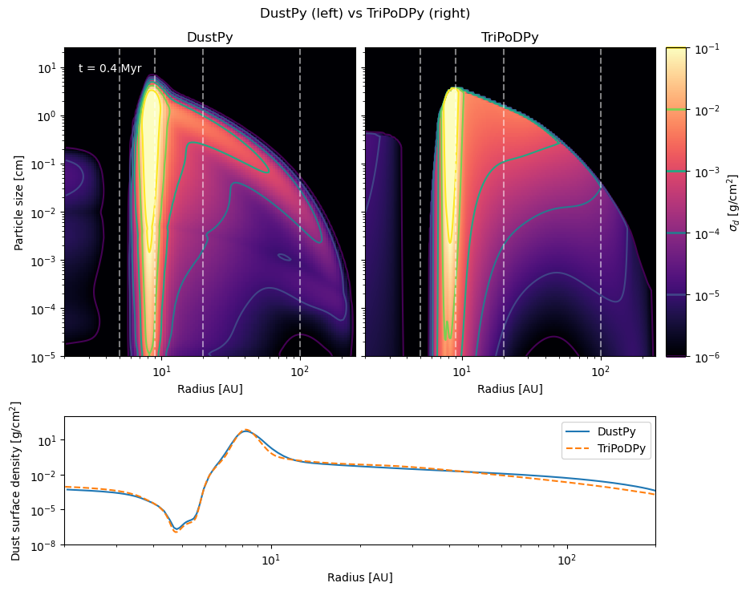
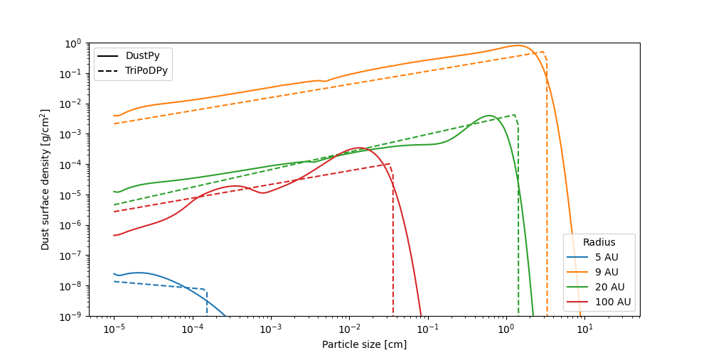

# Summary 

`TriPoDPy` is a code simulating the dust evolution, including dust growth and dynamics in protoplanetary disks using the parametric dust model presented in [@Pfeil2024]. The simulation evolves a dust distribution in a one-dimensional grid in the radial direction. It's written in `Python` and the core routines are implemented in `Fortran90`. The code not only solves for the evolution of the dust but also the gas disk with the canonical $\alpha$-description [@Shakura1973]. In addition to the original model, we added descriptions of tracers for the dust and gas, which could be used for compositional tracking of additional components.

# Statement of Need

Simulating the dust evolution in protoplanetary disks, including growth and transport, is vital to understanding planet formation and the structure of protoplanetary disks. There exist multiple open-source codes that tackle this problem by either solving the Smoluchowski Equation, e.g. `Dustpy`[@Dustpy] or `CuDisc`[@CuDisc] or using a Monte Carlo approach (e.g. `Mcdust` [@Vaikundaraman]) to simulate the mutual collisions between dust grains. However, all these simulations are computationally expensive, which calls for parametrised dust evolution models that can be used, for example, for population studies. Previous models, e.g. `Twopoppy` [@twopop], were not designed for disks with radial sub-structures and were not calibrated for different stellar masses.

These shortcomings are solved with the Tripod Dust model. It describes the dust size distribution with a truncated power law, which allows the simulation full access to the dust size distribution, which is essential to accurately model the dust evolution and additional physical effects like photoevaporation. Additionally, TriPodPy enables the addition of tracers in gas and dust, which could be used for tracking of chemical composition, electrical charge, and other parameters.

# Comparison Simulation

We compare a Simulation with our code with one performed with the full coagulation code `Dustpy`, illustrating how well our code performs. The parameters used for the comparison simulations can be found in the Table below:

| Parameter                                   | Value                 |
|:------------------------------------------- | :--------------------:|
| gas surface density at 1 AU                 | 722 g/$\mathrm{cm}^2$ |
| temperature at 1 AU                         | 209 K                 |
| turbulence strength ($\alpha$)              | $10^{-3}$             |
| fragmentation velocity ($v_{\mathrm{frag}}$)| 10 m/s                |
| gas surface density power law $p$           | 0.85                  |
| temperature power law $q$                   | 0.5                   |
| gap position                                | 5.2 AU                |
| $M_\text{planet}/M_{\star}$                 | $10^{-3}$             |

We compare the particle size distribution from both simulations at 400'000 years, which can be seen in the figures below. The first figure shows the dust surface density as a function of size and radius throughout the disk (top) and the total dust surface desity as a function of radius (bottom). The second plot shows 1-D slices at different radii as indicated by the white dashed lines.

The `TriPoDPy` simulation runs a factor of 50 to 100 faster than the compared `DustPy` model. As we can see, the maximal sizes and dust size distributions match quite well with the full coagulation code. Since the size distribution is always assumed to be a power law, capturing multimodal distributions is not possible, as can be seen around 100 AU in the test simulation. This also affects the dust distribution on the inside of the gap, as the dust size distribution in gaps deviates from the expected power law as well. For an in-depth discussion, see [@Pfeil2024].

# Acknowledgments
The authors acknowledge funding from the European Union under the European Unionʼs Horizon Europe Research and Innovation Programme 101124282 (EARLYBIRD) and funding by the Deutsche Forschungsgemeinschaft (DFG, German Research Foundation) under Germany’s Excellence Strategy - EXC-2094 - 390783311. Views and opinions expressed are, however, those of the authors only and do not necessarily reflect those of the European Union or the European Research Council. Neither the European Union nor the granting authority can be held responsible for them. 
# References

